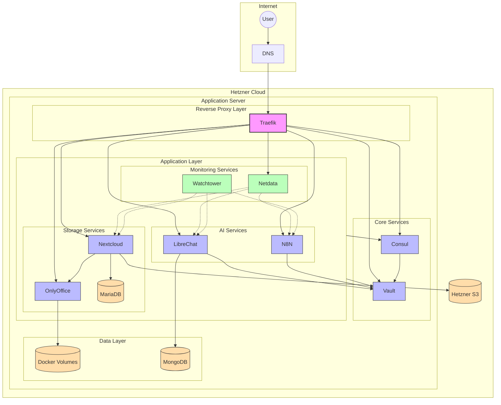

# AINI Architecture

## System Overview

AINI is an infrastructure management system that automates the deployment of AI and productivity tools. It uses Hetzner Cloud for hosting and implements a containerized microservices architecture.

## System Architecture



## Core Components

### Infrastructure Layer

1. **Hetzner Cloud Server**
   - Primary application server (configurable size)
   - Managed through Hetzner Cloud API
   - Provisioned using Ansible playbooks

2. **Docker + Docker Compose**
   - Container runtime
   - Service orchestration
   - Volume management

3. **Traefik**
   - Reverse proxy
   - SSL/TLS termination
   - Automatic certificate management
   - Service discovery

### State Management

1. **Consul**
   - Service discovery
   - Key-value store
   - Health checking
   - Configuration storage

2. **Vault**
   - Secrets management
   - API key storage
   - Credentials management
   - Encryption as a service

### Application Stack

1. **LibreChat**
   - AI chat interface
   - MongoDB backend
   - API integration capabilities

2. **N8N**
   - Workflow automation
   - AI agent orchestration
   - API integrations
   - Persistent workflow storage

3. **Nextcloud + OnlyOffice**
   - File storage and synchronization
   - Document editing
   - MariaDB backend
   - S3/Volume storage backend

4. **Supporting Services**
   - Netdata: System monitoring
   - Watchtower: Automatic updates

## Data Flow

1. **External Access**
   ```
   Internet -> Traefik -> Service
   ```

2. **Configuration Flow**
   ```
   Ansible -> Consul -> Services
   ```

3. **Secrets Flow**
   ```
   Vault -> Services (via API)
   ```

## Storage Architecture

1. **Local Storage**
   - Docker volumes for service data
   - Container filesystem for applications

2. **Remote Storage**
   - Hetzner S3 for Nextcloud backend (optional)
   - Hetzner Volumes for persistent storage (optional)

## Security Model

1. **Network Security**
   - Traefik handles SSL/TLS
   - Internal Docker network for inter-service communication
   - External access only through Traefik

2. **Authentication**
   - Basic auth for admin interfaces
   - OAuth2 for user services (where applicable)
   - API tokens managed by Vault

3. **Updates**
   - Automated through Watchtower
   - Configurable update schedules

## Deployment Process

1. **Server Provisioning**
   ```
   Ansible -> Hetzner API -> Server Creation
   ```

2. **Service Deployment**
   ```
   Ansible -> Docker Compose -> Service Startup
   ```

3. **Configuration**
   ```
   .env -> Docker Compose -> Services
   Consul -> Service Configuration
   ```

## Management Interfaces

1. **Infrastructure**
   - Traefik Dashboard: `traefik.domain.com`
   - Netdata: `netdata.domain.com`

2. **Services**
   - LibreChat: `chat.domain.com`
   - N8N: `n8n.domain.com`
   - Nextcloud: `cloud.domain.com`
   - OnlyOffice: `office.domain.com`

3. **Configuration**
   - Consul UI: `consul.domain.com`
   - Vault UI: `vault.domain.com`

## Development Setup

1. **Local Development**
   - Docker Compose for local stack
   - .env file for configuration
   - Local volume mounts

2. **Testing**
   - Pytest for Python components
   - Molecule for Ansible roles
   - Docker Compose for integration tests

## Backup Strategy

1. **Data Backups**
   - Service-specific backup procedures
   - Volume snapshots
   - S3 backups for Nextcloud

2. **Configuration Backups**
   - Consul state backups
   - Vault secrets backups
   - Docker volume backups